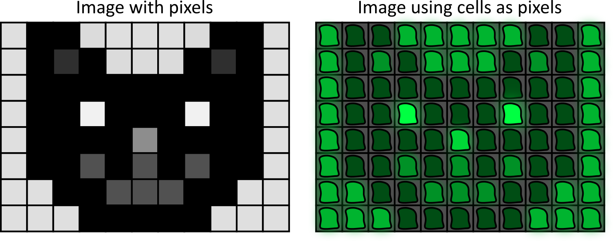
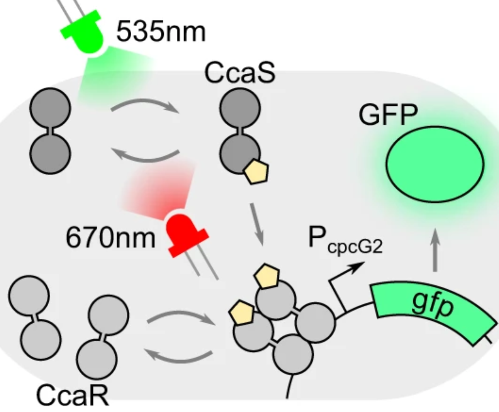

# Shining Colored Lights on Bacteria can Recreate Movie Scenes

-------------------------------------------------------------------------------------

08/08/2026 | Written by E.X. Markert\
_This article requires light knowledge of the central dogma (DNA → RNA → Protein) as well as positive and negative charges._

-------------------------------------------------------------------------------------

A few years ago, the Dunlop lab recreated a short gray-scale clip from _2001: A Space Odyssey_ with glowing bacteria[^Lugagne]. The first time I read about that project, it seemed like something out of a Sci-Fi film. It really did happen, though, which raises two questions: how did they do it and why does it matter?

First, we’ll talk about the “how”. Let’s take a step back and think about how displaying a gray-scale video works. Each frame of the video is a still image displayed on a grid of pixels, with the pixels glowing at different intensities. The lighter and darker spaces in the grid come together to make an image. To recreate this effect using bacteria, we start by assigning each bacterial cell to a grid coordinate. Then, we make the cells glow at different intensities.

To make the cells glow, we use green fluorescent protein (GFP)[^GFP]. GFP can absorb energy from blue or white light and become “excited”. However, it can’t hold energy in its excited state for very long. To stop being excited, it has to release all of the energy that it hasn’t already used. Releasing the excess energy causes an emission of green light (~509 nm).

Okay, so cells can glow. But how do we control how much a cell glows? Well, if we have more GFP, then more green light will be emitted. So, we can increase or decrease the amount that the cell glows by increasing or decreasing the amount of GFP in the cell. One way to do that is by controlling the expression of the GFP gene via a protein called a transcription factor.

The transcription factor that the Dunlop lab used is called CcaR. It has a partner protein called CcaS. When CcaS is exposed to a very specific wavelength of green light (~535 nm), it takes that energy and uses it to change shape. In CcaS’s new shape it adds a negatively charged phosphate molecule to CcaR in a process called _phosphorylation_.

Because the newly added phosphate molecule is negatively charged, CcaR changes its shape. The positively charged parts of CcaR are pulled closer to the phosphate while the negatively charged parts are pushed away[^phospho]. In its new shape, CcaR is able to bind to the GFP gene and “turn on” transcription. This increases the amount of GFP in the cell. So, shining green light on the cell causes the cell to glow brighter.

What if a cell is already bright and we need to make it dimmer? Then, instead of shining green light on the cell, we use red light. Under red light, CcaS reverts to its original shape and _dephosphorylates_ CcaR. Since CcaR is deactivated, GFP gene expression is turned off. Since GFP production stops and proteins degrade over time, the amount of GFP in the cell decreases. As a result, the cell glows less brightly.

<small>A schematic demonstrating how the CcaSR system that the Dunlop Lab used works. This image is from Lugagne _et al._ 2024 in Nature Communications. It is cropped from Figure 1 but is otherwise unaltered.</small>

So, we can use green light to make cells glow more and red light to make them glow less. Now we have all the tools we need to make a single frame in a video. However, videos are a series of frames. To transition from one frame to another, pixels are programmed to change how much they are glowing over time. Can we use our red and green light controls to make each individual cell glow in a specific pattern over time?

The answer is yes! We put each cell in a very small channel. Then, we can shine red or green lasers on each channel. These very precise lasers allow us to target specific cells with different stimuli at different times. Controlling gene expression this way is called _optogenetic control_[^opto].

The Dunlop lab performed optogenetic control in real time by setting a target sequence of fluorescence for each cell. Then, they used a deep learning model to find the sequence of red and green light that would cause the cell to glow the closest to the target sequence. The result was an imperfect but impressive reconstruction of the original clip from _2001: A Space Odyssey_.

Reconstructing a movie scene is cool, but why does it matter? Primarily, controlling gene expression this way enables us to study other biological processes more in depth. For example, we could artificially regulate a stress response gene to see how important it is or what other genes try to compensate. We could also investigate how different genes interact with each other by using more fluorescent reporters. Studying gene interactions is of particular interest to me because I hope to eventually investigate how randomness in gene expression is affected by other genes. That, however, is a topic for another day.

[^Lugagne]: See supplementary movie 3 in [Lugagne _et al._ 2024](https://doi.org/10.1038/s41467-024-46361-1) from Nature Communications. The paper covers a lot more than my summary does, and I’d highly recommend giving it a read!

[^GFP]: [Stearns 1995](https://doi.org/10.1016/S0960-9822(95)00056-X) from Cell Press is an old but good overview of GFP itself. All fluorescent proteins, including GFP, are a type of _fluorophore_. Fluorophores are a broader category of molecules that absorb and emit light. This [page](https://www.thermofisher.com/us/en/home/life-science/cell-analysis/cell-analysis-learning-center/molecular-probes-school-of-fluorescence/fluorescence-basics/fluorescence-fundamentals/process-fluorescence.html) from Thermo Fisher is a good explanation of how fluorophores work.

[^phospho]: Amino acids, which are what proteins are made of, are charged. This [Khan Academy article](https://www.khanacademy.org/test-prep/mcat/biomolecules/amino-acids-and-proteins1/a/amino-acid-structure-and-classifications) talks about different amino acid classifications and charges. This [Thermo Fisher article](https://www.thermofisher.com/us/en/home/life-science/protein-biology/protein-biology-learning-center/protein-biology-resource-library/pierce-protein-methods/phosphorylation.html) talks more broadly about phosphorylation.

[^opto]: [Lindner & Diepold 2022](https://doi.org/10.1093/femsre/fuab055) from Microbiology Reviews is a good, in-depth review of optogenetic control in bacteria.

_I welcome questions and comments about my writing. Feel free to reach out to me on LinkedIn!_